# WhatsApp，Telegram多账号管理工具
WhatsApp 多账号管理， Telegram 多账号管理，whatsapp实时翻译。
## 项目架构
- 桌面端：electron-egg
- 翻译端：Spring Boot 2.6.4 、 Mybatis-Plus、 JWT、Spring Security、Redis、Vue的前后端分离的后台管理系统
## 功能介绍
1. 账号多开，独立环境独立cookie数据，可无限多开管理账号
2. 独立代理，每个会话可以单独配置代理信息
3. 聚合翻译，软件内置翻译功能，聊天实时翻译，可自定义翻译语言
## 文档
- 桌面端使用基于electron开源框架electron-egg: https://www.kaka996.com
- 后台翻译授权后台管理端： https://eladmin.vip
## 项目截图
### 桌面端
- 登录
 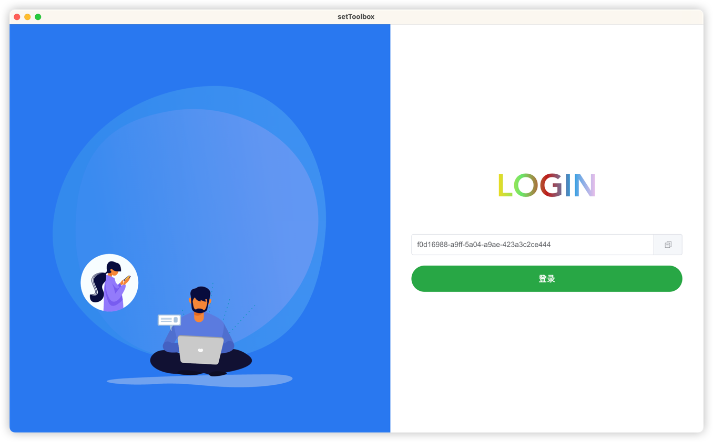
- 首页(统计功能还未实现，当前只是一个demo)
 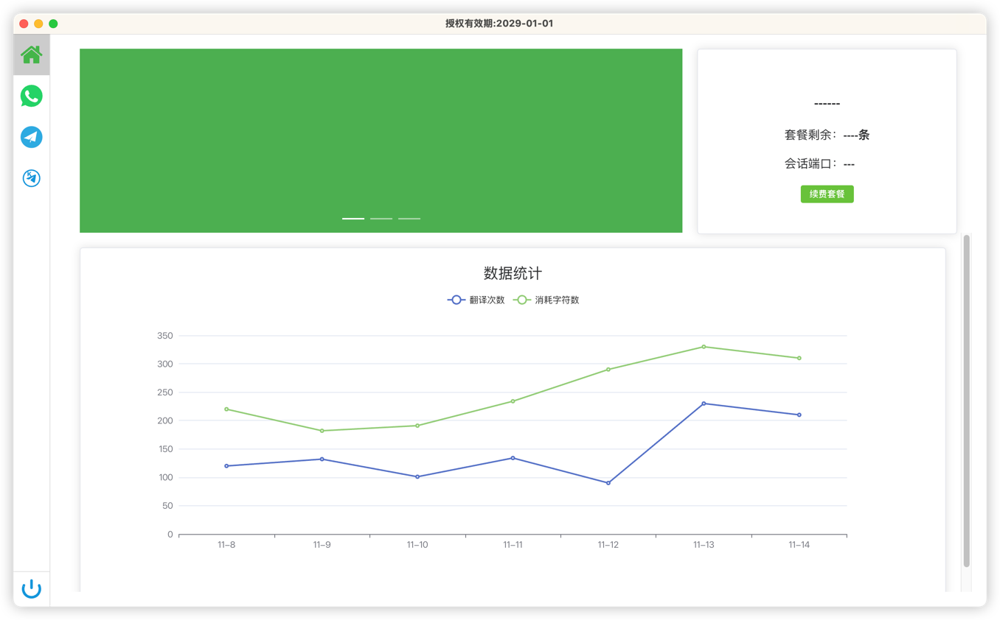
- 会话管理(WhatsApp)
 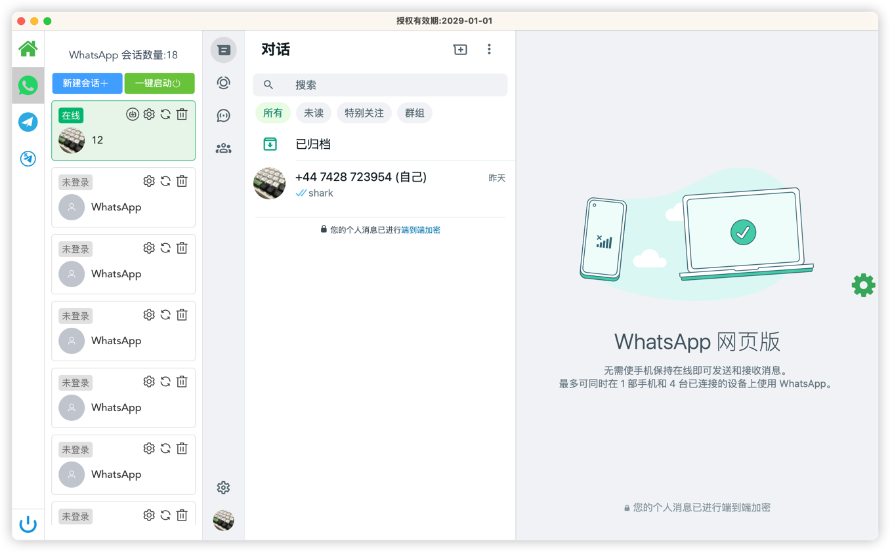
- 会话配置
 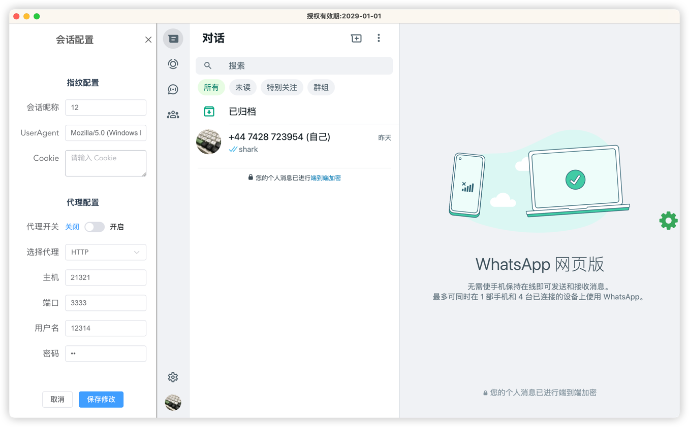
- 聊天翻译
 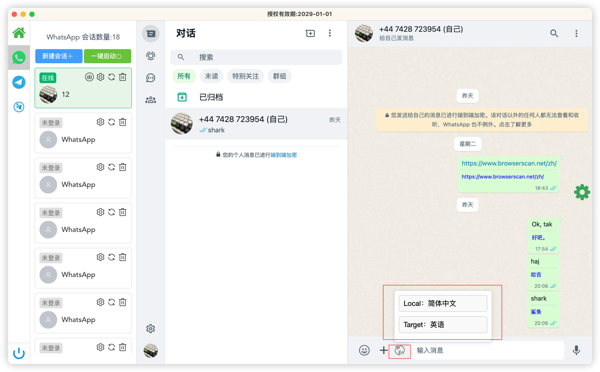
- 用户画像管理
 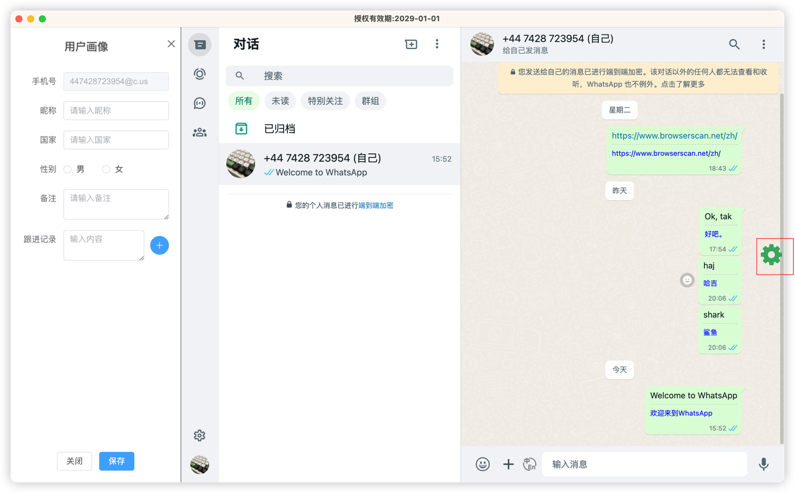
- 新消息通知
 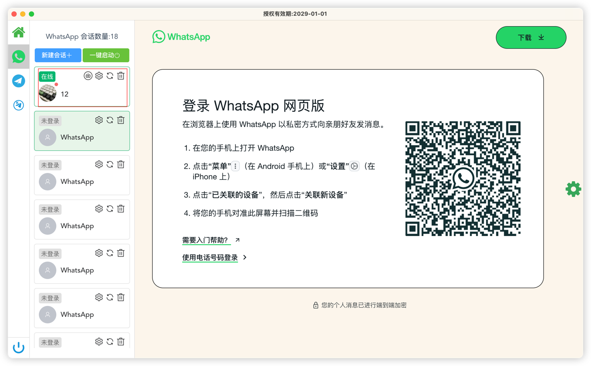
### 后台翻译端
- 授权管理（新用户自动登录默认会赠送3天授权，如有需求可自行在源码修改）
 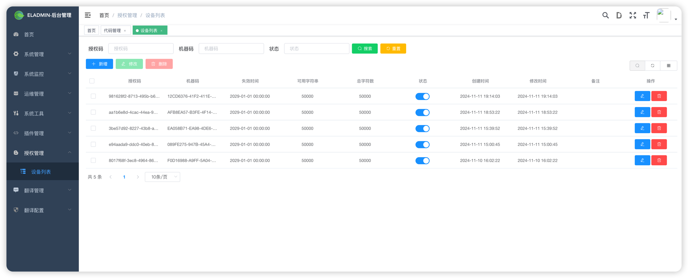
- 翻译记录管理（主要用于消息缓存，节省翻译api调用量）
 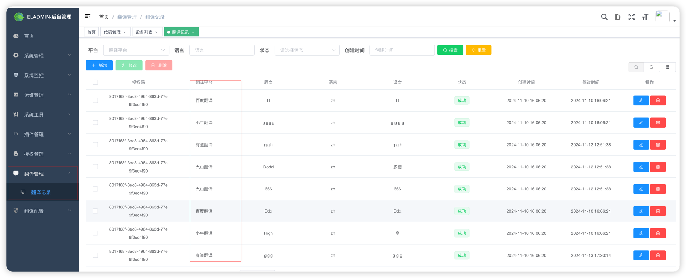
- 翻译配置(后台已对接五个平台翻译，api需自行注册获取并设置，如需添加更多平台也可在源码自行添加)
 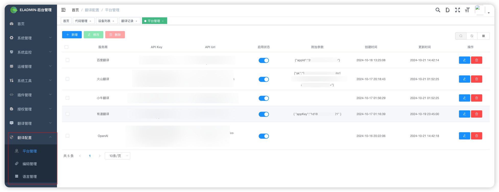
- 编码管理(每个平台对应的语言翻译的code不一致，需要自行添加并管理)
 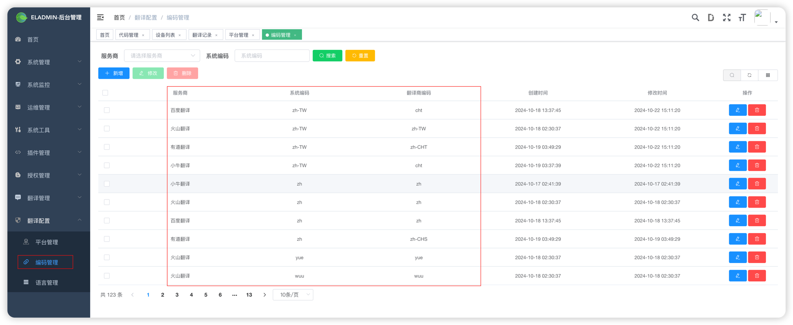
- 本地编码配置，因为每家翻译平台对应的编码存在不一致情况，所有设置了一个本地编码映射，统一管理编码
 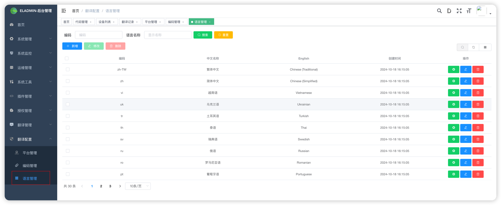
## 项目启动流程
- 先将后台翻译授权系统启动
- 启动成功后再启动该项目，进入根目录package.json文件，安装依赖然后运行npm dev即可
## 备注
- 项目目前只实现了基本的功能，有能力的可以直接拉取项目二次开发。
- 如果嫌弃麻烦也可以直接下载我打包后的软件直接体验。
- 欢迎提交宝贵意见，如有bug，请提交is，我看到有时间会进行修复。
## 免责声明
- 在使用本项目之前，您应自行评估并承担相应的风险。项目贡献者不保证本项目适合您的特定需求或用途，也不保证项目的完整性、准确性和及时性。

- 使用本项目即表示您同意自行承担所有风险和责任。对于因使用或无法使用本项目而引起的任何索赔、损害或其他责任，项目贡献者概不负责。
